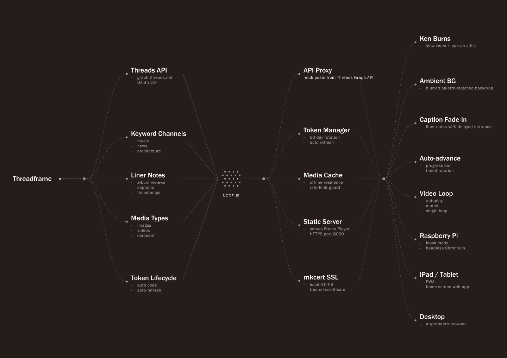
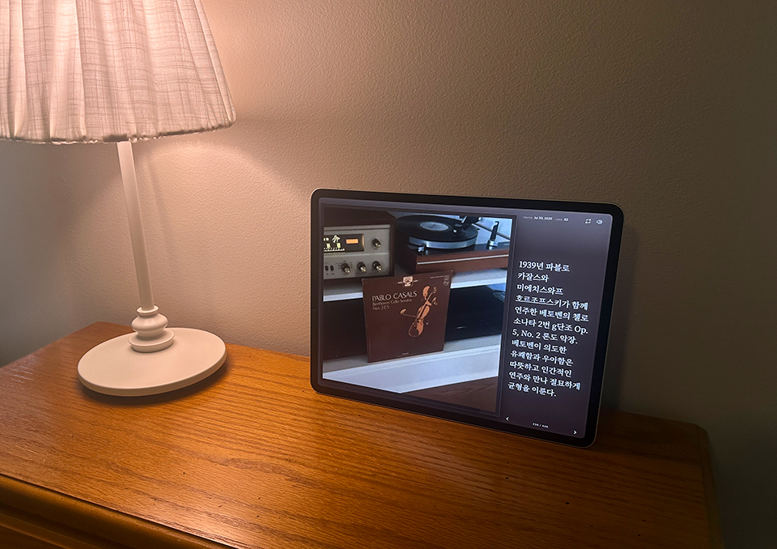
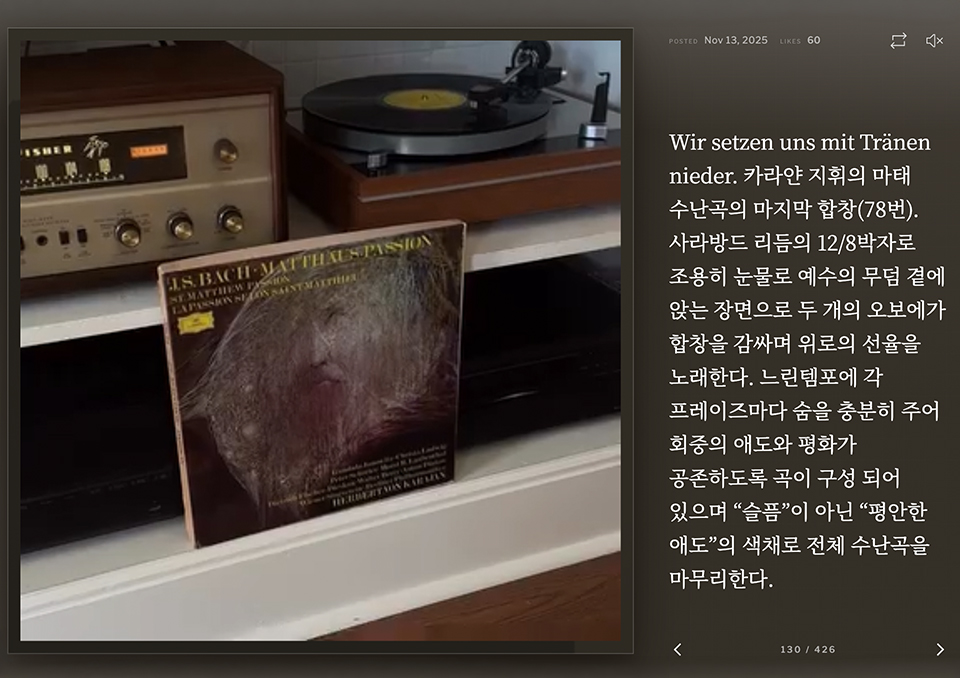
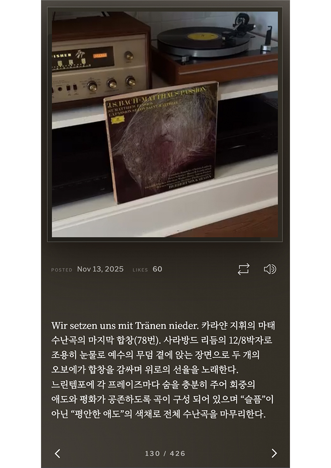

# Threadframe

**Threadframe** is a full-screen player that presents a Threads profile like a **wall-mounted editorial frame**: one post at a time, generous media, and typography that breathes. It is built for looking, not scrolling.

**Live:** [https://iwjong.github.io/threadframe/](https://iwjong.github.io/threadframe/)

<p align="center">
  
</p>

---

## Exhibit the thread, not the timeline

Threads is designed as a **feed**: small cards, fast thumb movement, constant novelty. That works on a phone; it works poorly when you want a post to **hold the room**.

Threadframe starts from a different question: *what if a thread were exhibited, not consumed?* The intent is **slow attention**: a single image or video given space, caption as editorial copy, and time to read before the next piece appears. Think gallery wall, bedside display, or opening-screen mood rather than social timeline.

Social apps optimize engagement; Threadframe optimizes **presence** and **legibility** at a distance.

---

## A magazine frame for one post at a time

Threadframe is a **2:1 magazine layout** split into two equal voices:

| Zone | Role |
|------|------|
| **Media stage** (left) | Square frame for image or video. Still posts use a subtle Ken Burns drift; video plays in place with optional sound. |
| **Typography panel** (right) | Date, likes, and caption set in a calm editorial column. Korean and Latin text are supported (Noto Serif KR + Libre Franklin). |

Around that core, the experience includes:

- **Ambient color:** the panel background and pattern shift from the dominant hues of the current post, so each piece brings its own atmosphere without manual theming.
- **Pacing:** a gold progress bar and ~7s default hold (video follows playback). Auto-advance can be interrupted with arrows or keyboard.
- **Launch ritual:** a short splash sequence before the first post, so the frame “wakes up” instead of popping content in cold.
- **Shuffle mode:** optional random order for variety on repeat viewing.

The **concept** is not “Threads in a browser tab.” It is **your thread, framed**: curated rhythm, print-like hierarchy, and display-first layout.

---

## How the frame is designed to behave

The design is held together by a few deliberate rules:

1. **One post, full stage.** Never show a grid or scroll list in the main view. Navigation is explicit (prev / next), which keeps the mental model physical: turning a page, not drowning in feed.

2. **Media leads, type follows.** Color and light from the image (or video frame) drive the right panel’s palette. Caption fades in slightly after media settles so the eye lands on the visual first.

3. **Contrast by extraction, not by fixed brand colors.** A broad pool of background and text pairings is chosen for readability against each extracted dominant color, so the frame stays vivid without a single static theme.

4. **Motion with restraint.** Ken Burns on stills, soft panel transitions, 3D media layer for depth: enough life for a screen Saver–like display, not enough to distract from the post itself.

5. **Display-safe defaults.** Video starts muted; UI chrome stays minimal (shuffle, sound, counter, arrows). The layout scales from phone stack to wide screen while keeping the square media anchor.

Together, these choices turn an API-backed archive into something that **reads as an object**: a frame on a wall, not a replica of the app.

---

## Examples

<p align="center">
  <br /><br />
  <br /><br />
  
</p>

---

## Technical

### Viewing the live site

Open [https://iwjong.github.io/threadframe/](https://iwjong.github.io/threadframe/)

| Control | Action |
|---------|--------|
| `→` / `←` | Next / previous post |
| On-screen arrows | Navigate |
| Shuffle / sound | Header controls (video) |

Posts refresh when the GitHub Actions workflow completes (not real-time).

### Deployment (GitHub Pages)

Static site: Actions fetch Threads data into `data/posts.json`, then publish `public/` to Pages.

**One-time setup**

1. **Settings → Pages → Source:** GitHub Actions  
2. **Settings → Secrets → Actions:** add `THREADS_ACCESS_TOKEN` (long-lived token only; copy from `.env` `INITIAL_ACCESS_TOKEN`, no `KEY=`, quotes, or `Bearer`)  
3. Push to `main` or run workflow **GitHub Pages (static)**

**Refresh:** every push to `main`; schedule 08:00 & 20:00 UTC; manual re-run from Actions tab.

**Architecture**

```text
  Threads API          GitHub Actions           GitHub Pages
       │                     │                        │
       │  repo secret         │  fetch-posts.mjs       │
       └────────────────────►│  → posts.json          │
                             └──────────► public/ ───► iwjong.github.io/threadframe/
```

**Troubleshooting**

| Error | Fix |
|--------|-----|
| Missing token | Add `THREADS_ACCESS_TOKEN` under Actions secrets |
| `Cannot parse access token` | Secret = token string only, not `API_SECRET` / full `.env` line |
| Verify: too short | Use `INITIAL_ACCESS_TOKEN` value from `.env` |

```bash
cp .env.template .env
npm install
npm run fetch:posts
```

### Local development

| Command | Purpose |
|---------|---------|
| `npm run dev` | HTTP on `127.0.0.1`; set `INITIAL_ACCESS_TOKEN` in `.env` |
| `npm start` | Local HTTPS + OAuth (`threads-sample.meta`, mkcert) |
| `npm run fetch:posts` | Build `data/posts.json` locally |

Meta app, mkcert, OAuth, optional Node server (Render, VPS): [docs/public/local-development.md](docs/public/local-development.md)

### Project structure

```text
threadframe/
├── public/              # Frame player UI
├── data/posts.json      # Generated snapshot (gitignored)
├── scripts/             # fetch-posts, validate-token
├── .github/workflows/   # pages.yml
├── server.js            # Optional live API proxy
└── lib/                 # Server helpers
```

### Security

- Do not commit `.env`, `*.pem`, or live `data/posts.json`.  
- Pages deploy: token only in Actions secrets; site serves public JSON.  
- Server mode: keep secrets in environment variables. See [local-development.md](docs/public/local-development.md).

### Git commits (no Cursor on Contributors)

This repo uses `.githooks` to remove `Co-authored-by: Cursor` from commit messages. After clone, run once:

```bash
git config core.hooksPath .githooks
```

In Cursor, you can also disable automatic co-author attribution in commit settings.

### References

| Resource | Link |
|----------|------|
| Threads API: tokens | [Meta Developers](https://developers.facebook.com/docs/threads/get-started/get-access-tokens-and-permissions) |
| Sample app | [fbsamples/threads_api](https://github.com/fbsamples/threads_api) |
| Postman | [Threads API collection](https://www.postman.com/meta/threads/collection/dht3nzz/threads-api) |
| Repo guide | [docs/public/postman-api-review.md](docs/public/postman-api-review.md) |

---

**Version:** 0.1 · **License:** UNLICENSED (private)
